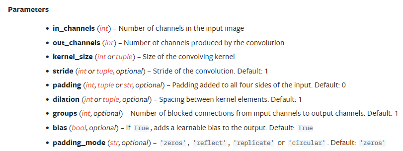
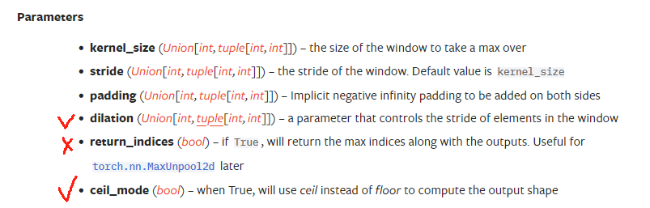
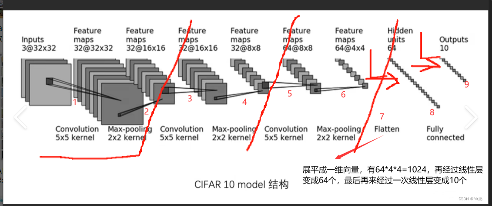
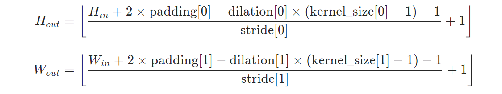
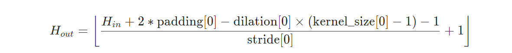
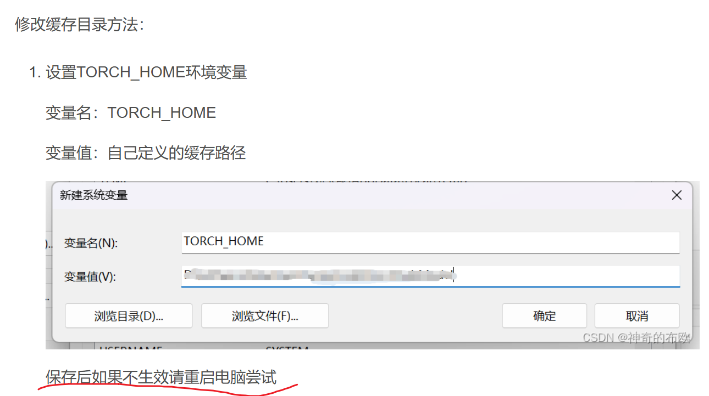

# torch.nn 卷积神经网络
## 1.Dataset 和 Dataloader
* 导入模块
```python
from torch.utils.data import Dataset, DataLoader
import torchvision
#如果是Dataset引入需要自己定义Mydataset
#此处不做详细介绍，只做土堆引入torchvision中的数据集
dataset = torchvision.datasets.CIFAR10("../data",train=False,transform=torchvision.transforms.ToTensor(),download=False)
dataloader = DataLoader(dataset,batch_size=64,shuffle=True)
```  

---

## 2.常见神经网络模版nn.module 和 nn.Conv2d
> 参考P12_torchnn文件
* 导入方法，同时导入卷积层  
```python
from torch import nn 
from torch.nn import Conv2d
from torch.utils.data import  DataLoader
from torch.utils.tensorboard import SummaryWriter

dataset = torchvision.datasets.CIFAR10("../data",train=False,transform=torchvision.transforms.ToTensor(),download=False)
dataloader = DataLoader(dataset, batch_size=64 , shuffle = True)
#定义成自己的类
#module包含初始化和前向函数forward
class Tudui(nn.Module):
    #初始化superinit
    def __init__(self):
        super(Tudui, self).__init__()
        #定义卷积层,在初始化里定义
        self.conv1 = Conv2d( in_channels=3, out_channels=3, kernel_size=3, stride=1, padding=0)
    #定义前向函数
    def forward(self,x):
        x = self.conv1(x)
        return x

tudui = Tudui()

```

* **_Conv2d的参数列表如下_** 
]  
in_channels :输入通道数  
out_channels :输出通道数  
stride :卷积核每次移动的长度  
padding:输入层边框是否添加一圈


[Module官网连接]()  
[Conv2d官网定义连接](https://docs.pytorch.org/docs/stable/generated/torch.nn.Conv2d.html#torch.nn.Conv2d)

* 卷积层使用例子  
```python
from torch.utils.tensorboard import  SummaryWriter
writer = SummaryWriter("../logs")

step = 0
for data in dataloader:
    imgs , targets = data
    # print(imgs.shape)
    output = tudui(imgs)
    # print(output.shape)
    #####注意是add_images，因为输入卷积的是打包的imgs
    writer.add_images("output",output,step)
    step += 1
#记得close，还不知道为什么
writer.close()
```  
---

## 3.最大池化MaxPooling
**_最大池化的作用：保留最大特征，减少数据量_**
> 参考P13_MaxPooling  ,池化核（取池子里最大的）  
> 最常用的还是**MaxPooling2d**  
[MaxPooling官网参考](https://docs.pytorch.org/docs/stable/generated/torch.nn.MaxPool2d.html#torch.nn.MaxPool2d)
* 基础定义  


1.stride： 默认步长为池化核大小，这是池化的定义
2.dilation ： 空洞卷积  
3.ceil_mode： 理解为去掉小数点还是直接取整
> 2.3  ceil--> :3  floor:-->2  

* 单次使用案例
```python
import torch
from torch import nn

input = torch.tensor([[1, 2, 0 ,3 ,1],
                      [0 ,1 ,2 ,3 ,1],
                      [1 ,2 ,1 ,0 ,0],
                      [5 ,2 ,3 ,1 ,1],
                      [2 ,1 ,0 ,1 ,1]], dtype=torch.float32)

input = torch.reshape(input,(1,5,5))
print(input.shape)

class Tudui(nn.Module):
    def __init__(self):
        super(Tudui, self).__init__()
        self.maxpool = nn.MaxPool2d(kernel_size=3, ceil_mode=True)

    def forward(self, input):
        output=self.maxpool(input)
        return output

tuidui = Tudui()
output = tuidui(input)
print(output)
```
* 数据集使用案例
```python
import torchvision
from torch import nn
from torch.utils.data import DataLoader
from torch.utils.tensorboard import SummaryWriter

dataset = torchvision.datasets.CIFAR10("../data",train=False,download=False,transform=torchvision.transforms.ToTensor())
dataloader = DataLoader(dataset,batch_size=64,shuffle=True)

class Tudui(nn.Module):
    def __init__(self):
        super(Tudui,self).__init__()

        self.maxpool = nn.MaxPool2d(kernel_size=3,ceil_mode=False)

    def forward(self, input):
        output = self.maxpool(input)
        return output

tudui = Tudui()

writer = SummaryWriter("MaxPooling")
step = 0
for data in dataloader:
    imgs, labels = data
    writer.add_images("input", imgs, step)
    output = tudui(imgs)
    writer.add_images("output", output, step)
    step += 1
writer.close()
```
---

## 4.Sequential快速搭建神经网络
假设我们搭建如下网络  

我们一共做了   
①3次（卷积+池化）-> ②Flatten拉平 ->③两次Liner线性化

①卷积+池化    
&emsp;卷积Conv2d输入计算公式：  
  
&emsp;其中stride步长默认为1，dilation默认为1
池化MaxPool2d输入计算公式：  

&emsp;其中stride步长默认为kernel边长，dilation默认为1
> ***注意***
> ①卷积如果不改变层的大小：那么只需要管padding和kernel比例关系
> Conv2d： 2padding = kernel-1
> ②池化使层面积变为1/4：只需要保证kernel=2，其他为默认
> MaxPool2d： 2padding = kernel

②Flatten
Just Flatten
```python
from torch.nn import Flatten
    Flatten()
```

③Liner线性化（记得要先拉伸）
目前来看Liner只要管in_features和out_features
代码如下
```python
from torch.nn import Linear
    Linear(1024,64)
    Linear(64,10)
```
**总体代码**
```python
#Squential快速搭建神经网络
import torch
from torch import nn
from torch.nn import Conv2d ,MaxPool2d,Flatten,Linear
from torch.utils.tensorboard import SummaryWriter


class Tudui(nn.Module):
    def __init__(self):
        super(Tudui, self).__init__()
        #->INPUT 3*32*32
        #->CONV2D Ker5*5 32*32*32
        #->MP ker2*2 32*16*16
        #->Conv2d ker5*5 32*16*16
        #->MP ker2*2 32*8*8
        #->Conv2d ker5*5 64*8*8
        #->MP KER2*2 64*4*4
        #->Flatten 64
        #Fullyconnected 10

        # self.conv1 = Conv2d(3,32,5,padding=2)
        # #参考Conv2d计算公式
        # self.maxpool1 = nn.MaxPool2d(2)
        # self.conv2 = Conv2d(32,32,5,padding=2)
        # self.maxpool2 = nn.MaxPool2d(2)
        # self.conv3 = Conv2d(32,64,5,padding=2)
        # self.maxpool3 = nn.MaxPool2d(2)
        # self.flatten = nn.Flatten()
        # self.linear1= nn.Linear(1024,64)
        # self.linear2 = nn.Linear(64,10)

        #尝试用Sequential简便构建网络
        self.model1 = nn.Sequential(
            Conv2d(3,32,5,padding=2),
            MaxPool2d(2),
            Conv2d(32,32,5,padding=2),
            MaxPool2d(2),
            Conv2d(32,64,5,padding=2),
            MaxPool2d(2),
            Flatten(),
            Linear(1024,64),
            Linear(64,10)
        )

    def forward(self, x):
        # x = self.conv1(x)
        # x = self.maxpool1(x)
        # x = self.conv2(x)
        # x = self.maxpool2(x)
        # x = self.conv3(x)
        # x = self.maxpool3(x)
        # x = self.flatten(x)
        # x = self.linear1(x)
        # output = self.linear2(x)
        output = self.model1(x)
        return output
#测试方法：
tudui = Tudui()
print(tudui)

#检验网络
input = torch.ones((64,3,32,32))
output = tudui(input)
print(output.shape)

writer = SummaryWriter("logs_Seq")
writer.add_graph(tudui, input)
writer.close()

###运行结果：torch.Size([64, 10])
```
结果为：torch.Size([64, 10])

可以看到Sequential节省了很多空间，也使得代码可读性更好

---

## 5.LOSS AND BP （Opitim）
> 本节课重点
> ①定义Loss
> ②使用优化器Optim进行反向传播  

我们需要在data输入进模型之后  
**计算Loss->重置梯度->反向传播->优化更新参数**

```python
tudui = Tudui()
loss = CrossEntropyLoss()#定义XXloss：：torch.nn
optim = torch.optim.SGD(tudui.parameters(),lr=0.01)#定义优化器，用于反向传播

for epoch in range(20):#epoch代表学习的轮数
    print("第"+str(epoch)+"轮训练")
    running_loss = 0.0
    for data in dataloader:
        imgs , targets = data
        outputs=tudui(imgs)
        # print(outputs)
        # print(targets)
        result_loss = loss(outputs, targets)
        optim.zero_grad()#清空梯度
        result_loss.backward()#反向传播
        optim.step()#对参数调优
        running_loss += result_loss
    print(running_loss)
```
---
## 6.Pretrained Models  
* 我们可以下载预训练好的模型进行修改
```python
import torchvision

vgg16_false = torchvision.models.vgg16(pretrained=False)
vgg16_true = torchvision.models.vgg16(pretrained=True)
print("ok")

print(vgg16_true)
```
pytorch会自动下载网络模型到C盘，我们需要修改环境变量，添加一个环境变量TORCH_HOME，然后***重启***

结果如下
```python
...
  (classifier): Sequential(
    (0): Linear(in_features=25088, out_features=4096, bias=True)
    (1): ReLU(inplace=True)
    (2): Dropout(p=0.5, inplace=False)
    (3): Linear(in_features=4096, out_features=4096, bias=True)
    (4): ReLU(inplace=True)
    (5): Dropout(p=0.5, inplace=False)
    (6): Linear(in_features=4096, out_features=1000, bias=True)
  )
)
```
我们这里可以看到VGG16的整体结构，最后是进行1000种分类  
当未来我们想应用这种模型，或者进行修改时，我们可以使用  
add_module('module_diyname',nn.xx)#for example nn.linear nn.MaxPool2d
代码如下
```python
vgg16_true.add_module('add_linear',nn.Linear(1000,10))
print(vgg16_true)
#vgg16_true.classifier.add_module('add_linear',nn.Linear(1000,10))
#classifier的区别就是最后显示可以在classifier内部添加module

  # (classifier): Sequential(
  #   (0): Linear(in_features=25088, out_features=4096, bias=True)
  #   (1): ReLU(inplace=True)
  #   (2): Dropout(p=0.5, inplace=False)
  #   (3): Linear(in_features=4096, out_features=4096, bias=True)
  #   (4): ReLU(inplace=True)
  #   (5): Dropout(p=0.5, inplace=False)
  #   (6): Linear(in_features=4096, out_features=1000, bias=True)
  # )
  # (add_linear): Linear(in_features=1000, out_features=10, bias=True)
```
* 如果想修改单独层(例如classifier中的层06)
```python
print(vgg16_false)
vgg16_false.classifier[6]=nn.Linear(4096,10)
print(vgg16_false)
#原本层[06] input:4096 ,output:1000
#修改线性层[06] input 4096 , output:10
```

---

## 7. 保存模型
保存模型的两种方式
1.保存模型结构+模型参数
**保存**
```python
import torch
import torchvision
#保存方式1,保存   模型结构+模型参数
torch.save(vgg16,'../models_saved/vgg16_method1.pth')
```
**读取**
```python
import torch
import torchvision

#加载1->对应->保存1 读取模型+参数
model = torch.load('../models_saved/vgg16_method1.pth',weights_only= False)
print(model)
#方式1存在陷阱
#你每次都需要重新定义你自己的模型类
```
---
2.以字典形式保存参数
**保存**
```python
#保存方式2，保存   模型参数（官方推荐）
torch.save(vgg16.state_dict(),'../models_saved/vgg16_method2.pth')
```
**读取**
```python
import torch
import torchvision
#加载2->对应->保存2 读取字典
vgg16 = torchvision.models.vgg16()
vgg16.load_state_dict(torch.load('../models_saved/vgg16_method2.pth'))
# model = torch.load('../models_saved/vgg16_method2.pth',weights_only= False)
```
---

## 8.